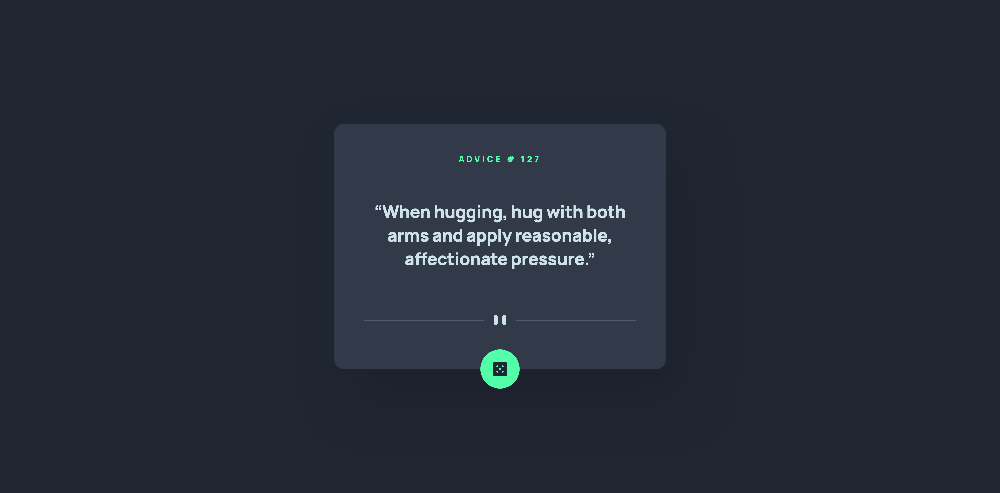
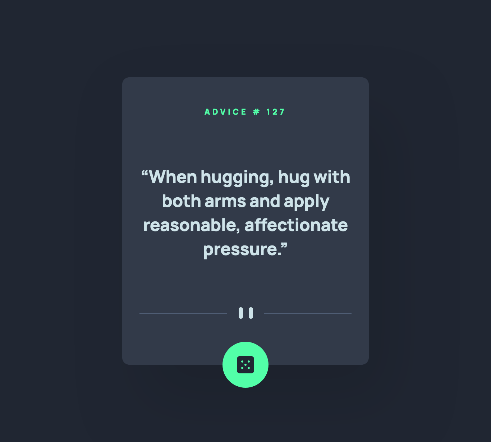
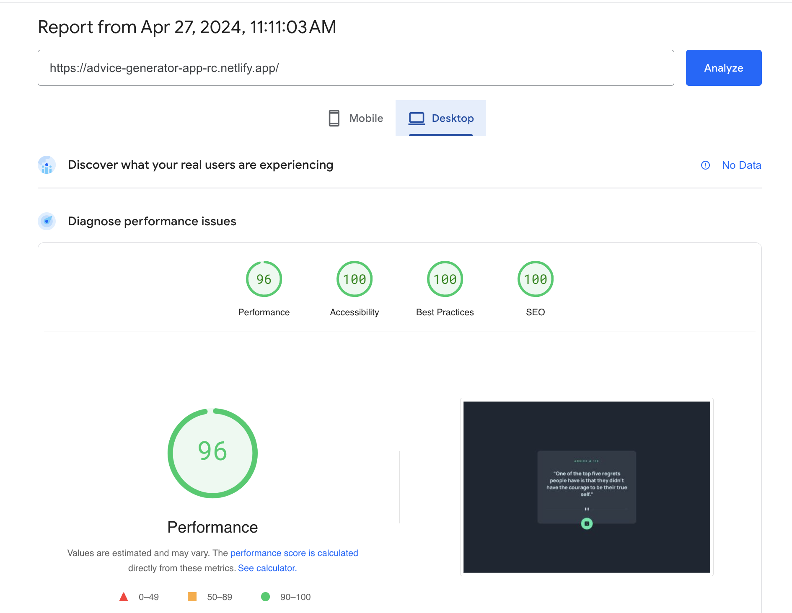

# Frontend Mentor - Advice generator app solution

This is a solution to the [Advice generator app challenge on Frontend Mentor](https://www.frontendmentor.io/challenges/advice-generator-app-QdUG-13db). Frontend Mentor challenges help you improve your coding skills by building realistic projects.

## Table of contents

- [Overview](#overview)
  - [The challenge](#the-challenge)
  - [Screenshots](#screenshots)
    - [1. Desktop version](#1-desktop-version)
    - [2. Mobile version](#2-mobile-version)
  - [PageSpeed Insights results](#pagespeed-insights-results)
  - [Links](#links)
- [My process](#my-process)
  - [Built with](#built-with)
  - [Tested with](#tested-with)
  - [What I learned](#what-i-learned)
  - [Continued development](#continued-development)
  - [Useful resources](#useful-resources)
- [Author](#author)
- [Acknowledgments](#acknowledgments)

## Overview

### The challenge

Users should be able to:

- View the optimal layout for the app depending on their device's screen size
- See hover states for all interactive elements on the page
- Generate a new piece of advice by clicking the dice icon

### Screenshots

##### 1. Desktop version



##### 2. Mobile version



### PageSpeed Insights results

[Mobile version](https://pagespeed.web.dev/analysis/https-advice-generator-app-rc-netlify-app/w97b29e4y9?form_factor=mobile)


[Desktop version](https://pagespeed.web.dev/analysis/https-advice-generator-app-rc-netlify-app/w97b29e4y9?form_factor=desktop)



### Links

- Solution URL: [Advice generator app Github URL](https://github.com/rupali317/advice-generator-app)
- Live Site URL: [Advice generator app live URL](https://advice-generator-app-rc.netlify.app/)

## My process

### Built with

- Semantic HTML5 markup
- CSS custom properties
- Flexbox
- Mobile-first workflow
- [Advice slip API](https://api.adviceslip.com)
- [React](https://reactjs.org/) - JS library
- [Styled Components](https://styled-components.com/) - For styles
- [Netlify](https://www.netlify.com/) - A cloud platform that provides hosting services

### Tested with

- Browsers used for testing: Google Chrome, Firefox, Safari, Brave, Microsoft Edge.
- Devices:
  - (Real) MacBook Pro (15 inch), Samsung Galaxy A33 5G, Samsung Galaxy S20+, iPad Air 2.
  - (Virtual) The mobile and tablet devices mentioned under Chrome's dev console.
- Screen reader: MacOS VoiceOver.

### What I learned

TBD

```html
<h1>Some HTML code I'm proud of</h1>
```

### Continued development

TBD

### Extra endeavours

- [elevenLabs](https://elevenlabs.io/)

## Author

- Website - [Rupali Roy Choudhury](https://www.linkedin.com/in/rupali-rc/)
- Frontend Mentor - [@rupali317](https://www.frontendmentor.io/profile/rupali317)

## Acknowledgments

- I express my gratitude towards my mentor - Deborah for the insightful code review session.
