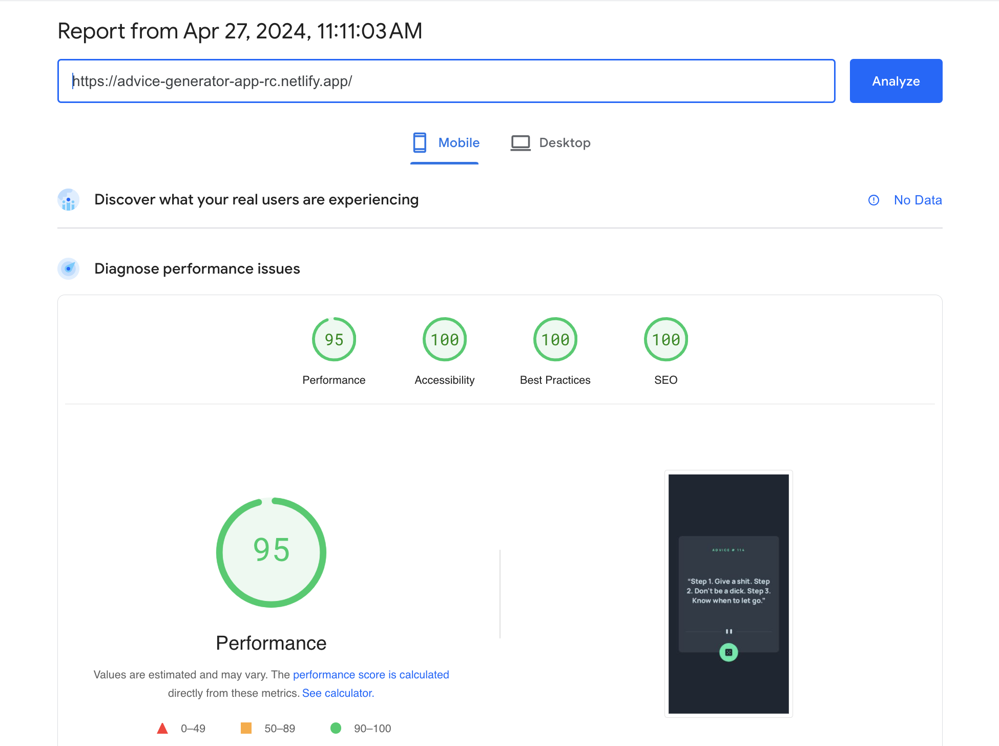

# Frontend Mentor - Advice generator app solution

This is a solution to the [Advice generator app challenge on Frontend Mentor](https://www.frontendmentor.io/challenges/advice-generator-app-QdUG-13db). Frontend Mentor challenges help you improve your coding skills by building realistic projects.

## Table of contents

- [Overview](#overview)
  - [The challenge](#the-challenge)
  - [Screenshots](#screenshots)
    - [1. Desktop version](#1-desktop-version)
    - [2. Mobile version](#2-mobile-version)
  - [PageSpeed Insights results](#pagespeed-insights-results)
  - [Links](#links)
- [My process](#my-process)
  - [Built with](#built-with)
  - [Tested with](#tested-with)
  - [What I learned](#what-i-learned)
  - [Continued development](#continued-development)
  - [Extra endeavours](#extra-endeavours)
- [Author](#author)
- [Acknowledgments](#acknowledgments)

## Overview

### The challenge

Users should be able to:

- View the optimal layout for the app depending on their device's screen size
- See hover states for all interactive elements on the page
- Generate a new piece of advice by clicking the dice icon

### Screenshots

##### 1. Desktop version


##### 2. Mobile version


### PageSpeed Insights results

[Mobile version](https://pagespeed.web.dev/analysis/https-advice-generator-app-rc-netlify-app/w97b29e4y9?form_factor=mobile)



[Desktop version](https://pagespeed.web.dev/analysis/https-advice-generator-app-rc-netlify-app/w97b29e4y9?form_factor=desktop)


### Links

- Solution URL: [Advice generator app Github URL](https://github.com/rupali317/advice-generator-app)
- Live Site URL: [Advice generator app live URL](https://advice-generator-app-rc.netlify.app/)

## My process

### Built with

- Semantic HTML5 markup
- CSS custom properties
- Flexbox
- Mobile-first workflow
- [Advice slip API](https://api.adviceslip.com)
- [React](https://reactjs.org/) - JS library
- [Styled Components](https://styled-components.com/) - For styles
- [Netlify](https://www.netlify.com/) - A cloud platform that provides hosting services

### Tested with

- Browsers used for testing: Google Chrome, Firefox, Safari, Brave, Microsoft Edge.
- Devices:
  - (Real) MacBook Pro (15 inch), Samsung Galaxy A33 5G, Samsung Galaxy S20+, iPad Air 2.
  - (Virtual) The mobile and tablet devices mentioned under Chrome's dev console.
- Screen reader: MacOS VoiceOver.

### What I learned

- Different browsers have different Javascript engines and can behave differently. For instance, when I clicked on the icon button in Firefox, it was not generating the advice. While debugging, I noticed that the API was generating the same response and as a result, it gave an impression that the app was failing in Firefox. Even though, the API fetched different responses in other browsers, there seemed to be a caching issue in Firefox.

### Continued development

- In Firefox, I noticed that on clicking the icon button, it returns the same response, which indicates a caching issue. Inspite of including `Cache-Control: no-cache` to the header of the fetch request, it produce runtime fetch error - failed to fetch. The browser prevented cross-origin requests. I used a simple proxy `http-proxy-middleware` and provided a setupProxy.js file with the following content:

```js
const { createProxyMiddleware } = require("http-proxy-middleware");

module.exports = function (app) {
  app.use(
    "/api",
    createProxyMiddleware({
      target: "https://api.adviceslip.com",
      changeOrigin: true,
      pathRewrite: {
        "^/api": "", // remove /api prefix
      },
    })
  );
};
```

and in my AdviceCard.jsx I changed the fetch request to `const response = await fetch("/api/advice");` Though it solved the Firefox issue in my localhost, it did not work when I published my solution to Netlify. This could be due to the way Netlify handles proxying or routing requests. It will be a good opportunity to delve deeper into this.

- Exploring dark mode will be a good idea since one of my users use dark mode to view the URL. In dark mode, the look and feel was not ideal since the user clicked on the seperator first instead of the button. It caused confusion to the user. Good opportunity to fix the visuals in dark mode.

### Extra endeavours

- During a hackathon I came across a resource [11ElevenLabs](https://elevenlabs.io/) that enabled one to clone one's voice and use that voice to convert text to speech. I used [11ElevenLabs's API](https://elevenlabs.io/docs/api-reference/text-to-speech) to use my voice on the speech generated by the advice slip API. Though there were some bugs, I was able to achieve my personal goal of this project: reading out the advice in my voice. The drawback is that it may not be ideal for accessibility especially when screen reader is used since screen reader will read the text as well. Therefore, those who rely on screen readers will hear my voice as well as the screen reader's voice.

## Author

- Website - [Rupali Roy Choudhury](https://www.linkedin.com/in/rupali-rc/)
- Frontend Mentor - [@rupali317](https://www.frontendmentor.io/profile/rupali317)

## Acknowledgments

- I express my gratitude towards my mentor - Deborah for the insightful code review session.
- I also thank members of Front end mentors - Grace Snow and Alex Marshall for providing insights related to the Firefox issue (as mentioned above)
